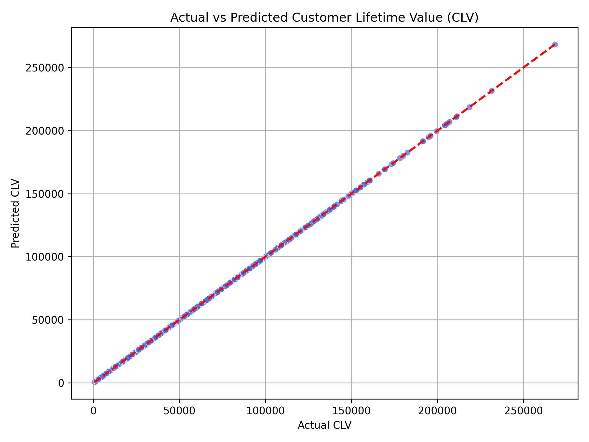

# ✈️ Customer Loyalty Behavior Analysis with RFM Segmentation and CLV Prediction

This project analyzes customer loyalty behavior in a frequent flyer program using **RFM segmentation** and **Customer Lifetime Value (CLV) prediction**. It includes exploratory data analysis, segmentation, and regression modeling to help businesses identify their most valuable customers and make data-driven marketing decisions.

---

## 📌 Project Objectives

- Perform **RFM segmentation** to categorize customers based on:
  - **Recency**: How recently they engaged
  - **Frequency**: How often they flew
  - **Monetary**: Total points accumulated
- Analyze loyalty behavior and redemption patterns
- Calculate **Customer Lifetime Value (CLV)**
- Build a **regression model** to predict future CLV
- Visualize insights and export key deliverables

---

## 🧠 Techniques & Tools Used

- Python (Pandas, NumPy, Seaborn, Matplotlib, Scikit-learn)
- RFM segmentation
- CLV calculation
- Linear Regression modeling
- Data visualization
- Git/GitHub for version control

---

## 📊 Key Insights

- **Champions and Frequent Flyers** contribute the highest lifetime value
- **Most customers redeem very few points**
- A small number of customers are responsible for the majority of revenue
- Built a regression model to predict CLV with **R² = 1.00**

---

## 📁 Project Files

| File | Description |
|------|-------------|
| `loyalty_analysis.ipynb` | Main notebook with code, analysis, and visualizations |
| `rfm_clv_segments.csv` | Final dataset with RFM scores, segments, and CLV |
| `actual_vs_predicted_clv.png` | Scatter plot of predicted vs actual CLV |
| `README.md` | Project overview and documentation |

---

## 📌 How RFM Works

**RFM = Recency, Frequency, Monetary**

- **Recency (R)**: How recently the customer flew
- **Frequency (F)**: How often the customer flew
- **Monetary (M)**: Total points or value generated

Customers are scored and segmented based on RFM values into:
- **Champions**
- **Loyal**
- **Frequent Flyers**
- **High Spenders**
- **At Risk**
- **Others**

---

## 📈 CLV Prediction

We used **Linear Regression** to predict Customer Lifetime Value (CLV) based on RFM metrics.  
This helps the business estimate future value of customers and personalize retention strategies.

---

## ✅ Conclusion

This project demonstrates how businesses can leverage RFM analysis and CLV prediction to:
- Identify top-performing customers
- Tailor loyalty campaigns
- Predict future revenue
- Optimize customer retention efforts

---

## 🔗 Connect with Me

- **GitHub**: [github.com/Bangaly-DS](https://github.com/Bangaly-DS)
- **LinkedIn**: [linkedin.com/in/sano-bangaly-064535146](https://linkedin.com/in/sano-bangaly-064535146)

